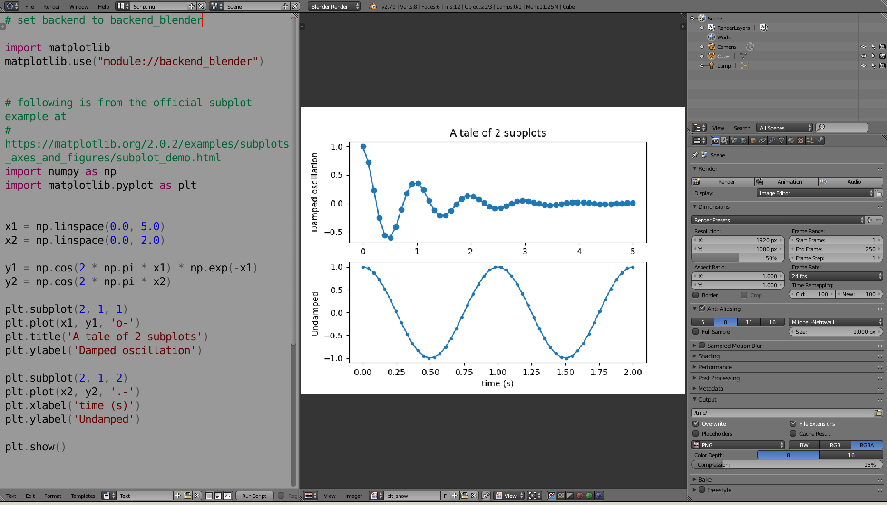

# blender_matplotlib
matplotlib backend for blender



# dependencies
- numpy version should be over 0.14.
- matploblib should be downloaded with its dependencies.

Above should be installed into the python packed with blender. To use pip for this python, [this stackflow post]( https://blender.stackexchange.com/questions/56011/how-to-use-pip-with-blenders-bundled-python?answertab=votes#tab-top) should be useful.

# how to use
## import

Place this file as a library of blender. This can be done by using the add-on importer.

## use matplotlib.use

```python
import matplotlib
matplotlib.use("module://backend_blender")
```

## use as always!
use as always !!! (sample code from [official sample](https://matplotlib.org/2.0.2/examples/subplots_axes_and_figures/subplot_demo.html))

```python
import numpy as np
import matplotlib.pyplot as plt


x1 = np.linspace(0.0, 5.0)
x2 = np.linspace(0.0, 2.0)

y1 = np.cos(2 * np.pi * x1) * np.exp(-x1)
y2 = np.cos(2 * np.pi * x2)

plt.subplot(2, 1, 1)
plt.plot(x1, y1, 'o-')
plt.title('A tale of 2 subplots')
plt.ylabel('Damped oscillation')

plt.subplot(2, 1, 2)
plt.plot(x2, y2, '.-')
plt.xlabel('time (s)')
plt.ylabel('Undamped')

plt.show()
```
